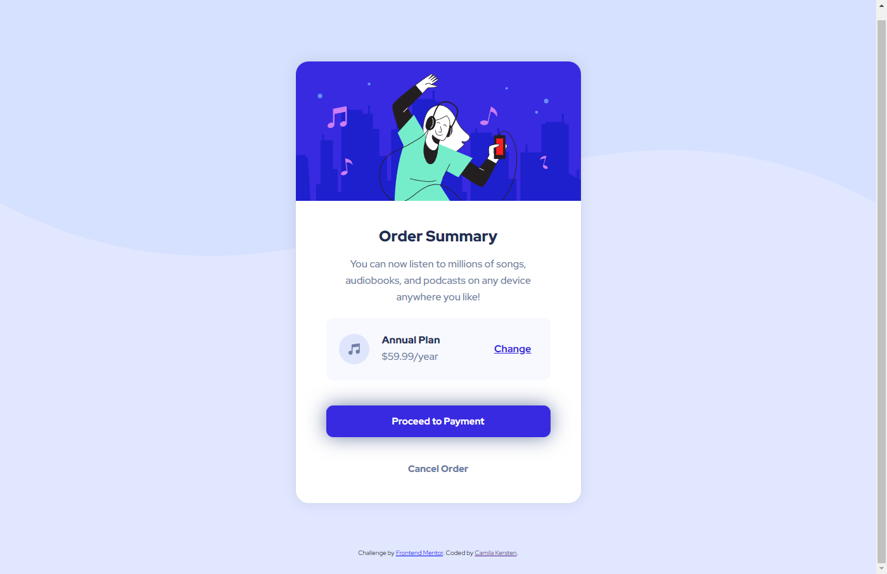

# Frontend Mentor - Order summary card solution

This is a solution to the [Order summary card challenge on Frontend Mentor](https://www.frontendmentor.io/challenges/order-summary-component-QlPmajDUj). Frontend Mentor challenges help you improve your coding skills by building realistic projects. 

## Table of contents

[Screenshot](#screenshot)
[Links](#links)
[Built with](#built-with)
[Author](#author)
[Acknowledgments](#acknowledgments)

### Screenshot

### Links

- Solution URL: [GitHub Repository](https://github.com/camilakersten/Frontend-Mentor---Order-summary-card-solution/tree/main)
- Live Site URL: [Live site](https://camilakersten.github.io/Frontend-Mentor---Order-summary-card-solution/)

### Built with

- Semantic HTML5 markup
- CSS custom properties
- Flexbox

## Author

- GitHub - [Camila Kersten](https://github.com/camilakersten)
- Linkedin - [Camila Kersten](https://www.linkedin.com/in/camilakersten/)
- Frontend Mentor - [@camilakersten](https://www.frontendmentor.io/profile/camilakersten)
